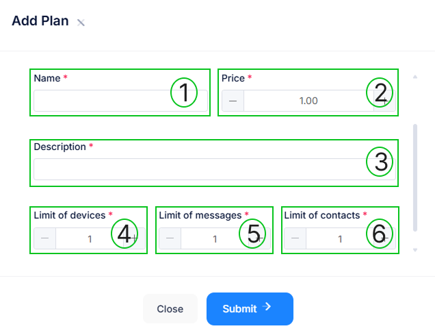

# Planes

En esta sección, aprenderás cómo crear, gestionar y administrar planes. Los planes permiten establecer distintos niveles de acceso y uso del sistema para las cuentas de empresa.

## Acceder a la sección de Planes

1. Inicia sesión en el sistema reseller.
2. En el menú lateral, selecciona la opción **Planes**.
3. Se mostrará una lista con todos los planes creados.

## Crear un nuevo Plan

Para crear un nuevo plan, sigue estos pasos:

1. Dentro de la sección **Planes**, haz clic en el botón **Nuevo (+ New)**.
2. Se abrirá un formulario con los siguientes campos:

   - **1. Nombre del plan**: Ingresa un nombre representativo para el plan.
   - **2. Precio**: Define el precio del plan. Si es un plan gratuito, activa la opción correspondiente.
   - **3. Descripción**: Escribe una breve descripción del plan.
   - **4. Límite de dispositivos**: Define cuántos dispositivos pueden usar este plan.
   - **5. Límite de mensajes**: Establece la cantidad de mensajes permitidos.
   - **6. Límite de contactos**: Indica cuántos contactos se pueden registrar con este plan.
3. Una vez completados los datos, haz clic en **Submit (Enviar)** para guardar el plan.

## Administrar los planes existentes
En la sección **Planes**, puedes visualizar y administrar los planes creados. Para cada plan se muestra:

- **Estado**: Indica si el plan está activo o inactivo.
- **Nombre del plan**.
- **Límite de dispositivos**.
- **Límite de mensajes**.
- **Límite de contactos**.
- **Precio**.
- **Acciones**: Se incluyen opciones para editar o eliminar un plan.

## Editar un plan
1. En la lista de planes, busca el plan que deseas modificar.
2. Haz clic en el ícono de edición (🖊️).
3. Realiza los cambios necesarios en los campos.
4. Guarda los cambios haciendo clic en **Submit (Enviar)**.

## Eliminar un plan
1. En la lista de planes, ubica el plan que deseas eliminar.
2. Haz clic en el ícono de eliminar (🗑️).
3. Confirma la acción para eliminar el plan de manera definitiva.

Con esta gestión de planes, puedes estructurar diferentes niveles de servicio para las cuentas de empresa y administrar de manera eficiente los recursos del sistema.

