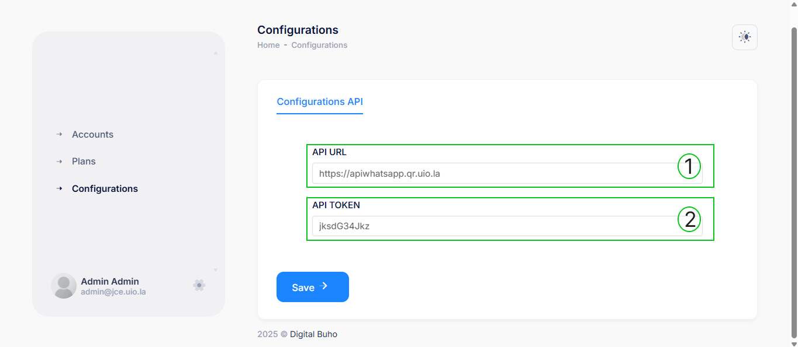

# Configuración

La sección de configuración del reseller permite gestionar los parámetros esenciales para la conexión con la API de QrBuho. Desde aquí, se pueden establecer las credenciales necesarias para que el sistema funcione correctamente.

## Acceso a la Configuración
Para acceder a la configuración, dirígete al menú lateral y selecciona **Configurations**. Esto te llevará a la pantalla de configuración donde podrás gestionar los siguientes parámetros:

### Parámetros de Configuración

- **API URL**: Dirección del endpoint al que se conectará el sistema. 

    Ejemplo: `apiwhatsapp.qr.uio.la`.

- **API TOKEN**: Clave de autenticación que permite validar las solicitudes a la API.

### Guardar Cambios
Una vez ingresados los datos, presiona el botón **Save** para almacenar la configuración. Esto asegurará que el sistema utilice las credenciales correctas para la integración con la API.

Esta configuración es fundamental para garantizar la comunicación entre el sistema del reseller y la API de QrBuho, permitiendo el correcto funcionamiento de todas sus funcionalidades.

